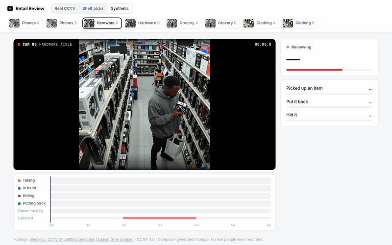

# clef-retail-review

**Ask an open decision model what happens in a store camera clip, and when.**



*Real store CCTV from UCF-Crime, then a shopper at a shelf from the MERL Shopping Dataset. Both are research-only footage; see [The footage](#the-footage).*

[Clef-flash](https://huggingface.co/Cloudflare/clef-flash) is a 9B open-weight model from Cloudflare that answers typed questions (yes/no, pick one, score) with a probability for every option. It doesn't write text. It reads images and video too, and it runs on one consumer GPU.

A model like that gets filed under "classifier". I wanted to see if it could do something a classifier can't: watch a clip, answer several separate questions about it, and point at the moment that mattered. Nothing here is trained or fine-tuned. Every number below comes from asking questions in plain English.

This is meant to **flag clips for a person to look at**. It doesn't catch anyone. A flag means "someone should watch these few seconds", nothing more.

## What's on the screen

- **The camera.** The clip plays on a loop. When the model thinks something is happening at that moment, a tag shows up on the video (`Taking 54%`, `Hiding 93%`).
- **The timeline.** The clip is cut into 1.5-second windows every half second. Each window gets four questions: are they taking something off a shelf, is a product in their hand, are they hiding it, are they putting it back? The darker the cell, the more sure the model is. This is the part that answers *when*.
- **Drove the flag.** Each sixth of the clip is greyed out in turn and the whole clip is asked again. A segment lights up when greying it out makes the flag drop.
- **Labelled.** What the dataset itself says happened, and when. It's there so you can check the model by eye.
- **The flag.** Three questions about the whole clip: did they pick something up, did they put it back, did they hide it. The flag is `hid it × (1 − put it back)`, so taking something and returning it never gets flagged, however suspicious it looks.

Click the timeline to jump to that moment.

## The footage

There are three sets, picked to test different things.

| Set | What it is | Clips | License |
|---|---|---|---|
| **Real CCTV** | Shoplifting videos from [UCF-Crime](https://www.crcv.ucf.edu/projects/real-world/): real store cameras, real incidents. Taken from the DCSASS split ([mirror](https://huggingface.co/datasets/Centrique/tcc-shoplifting)), which labels each 1 to 5 second segment as theft or not. | 6 thefts, 3 stretches with no theft labelled, from 6 stores | Research use only |
| **Shelf picks** | The [MERL Shopping Dataset](https://www.merl.com/research/downloads/MERL_Shopping_Dataset) ([mirror](https://huggingface.co/datasets/Voxel51/MERL_Shopping_Dataset)): real people filmed by an overhead camera at grocery shelves, with frame-accurate labels for every reach into the shelf. | 3 | Non-commercial research only |
| **Synthetic** | The free sample of Simuletic's [CCTV Shoplifting Detection Dataset](https://www.kaggle.com/datasets/simuletic/cctv-shoplifting-detection-dataset-yolo-and-vlm). Computer-generated store cameras, in matched pairs: the same shopper either hides the item or puts it back. | 8 | CC BY 4.0 |

The first two sets are real footage, but neither license allows commercial use. The GIF above shows clips from both, so treat it as research material too. For anything commercial, use the synthetic set or footage you record yourself.

## Results

### Shelf picks: does it see the moment an item is taken?

Yes. This is the clearest result in the project.

| Clip | Labelled reaches found | "Taking" windows that sit on a labelled reach |
|---|---|---|
| Picks A | 1 of 1 | 5 of 6 |
| Picks B | 3 of 3 | 11 of 11 |
| Picks C | 2 of 2 | 7 of 7 |

A reach counts as found when a window over it says "Taking" at 50% or more. All three clips are correctly left unflagged (7 to 12%).

### Real CCTV: does it flag real thefts?

Mostly not, and it's worth being clear about that.

| Clip | Labelled theft | Flag | Hid it |
|---|---|---:|---:|
| Electronics A (tablet under a towel) | yes | 6% ✗ | 10% |
| Electronics B (same man, before) | no | 6% | 7% |
| Electronics C (item into a jacket) | yes | **59%** | 66% |
| Grocery A (pocketing) | yes | 12% ✗ | 15% |
| Grocery B (same aisle, later) | no | 4% | 5% |
| Stationery (box into a bag) | yes | 41% ✗ | 62% |
| Phone A (phone off the counter) | yes | 20% ✗ | 32% |
| Phone B (same counter, earlier) | no | 29% | 36% |
| Cosmetics | yes | 9% ✗ | 10% |

One of six thefts gets flagged, and none of the three stretches without a theft does. Where it does flag (Electronics C), "Drove the flag" is strongest at 10 to 13.5 s, inside the labelled theft (8 to 14 s).

I think the gap is mostly the footage. These videos are 320×240, the people are small, and the thefts are quick hand movements that are hard to make out even when you know where to look. The model reliably sees that something was picked up (the "In hand" lane on Electronics A lights up while he holds the tablet). It just can't see where the item ended up. I tried two fixes on all 17 theft and no-theft clips. Neither changed the result, so I left the settings alone:

- wording the question as "hide *or cover*": 11 of 17 right either way
- doubling the frame rate of the timeline windows: helped the synthetic clips (Phones A hiding went from 0.39 to 0.65), but the strongest "Hiding" window still landed on a labelled theft in 6 of 10 theft clips, same as before, and it doubles the cost

The DCSASS labels are per segment, so the "Labelled" strip on these clips is only accurate to a few seconds.

### Synthetic: the matched pairs

| Clip | Should flag | Flag | Hid it | Put it back |
|---|---|---:|---:|---:|
| Phones A | yes | 32% ✗ | 40% | 20% |
| Phones B | no | 0% | 1% | 81% |
| Hardware A | yes | 66% | 74% | 11% |
| Hardware B | no | 1% | 9% | 87% |
| Grocery A | yes | 59% | 71% | 17% |
| Grocery B | no | 1% | 4% | 84% |
| Clothing A | yes | 81% | 88% | 8% |
| Clothing B | no | 2% | 6% | 74% |

7 of 8 are right. None of the put-back clips gets above 2%. In every hiding clip the strongest "Hiding" window overlaps the labelled action. The miss is Phones A, where a woman tucks a box under her jacket while facing the camera.

Twenty clips is a demo, not a benchmark. Don't read any of this as an accuracy figure.

### Speed

On an RTX 4090, in bfloat16:

| | |
|---|---|
| Whole clip, 3 questions, 6 s (24 frames) | 0.54 s |
| Whole clip, 3 questions, 18 to 20 s (72 to 80 frames) | 1.15 to 1.30 s |
| One 1.5 s window, 4 questions | 0.16 to 0.19 s |
| Full review of a 20 s clip (45 calls) | 15 s |
| GPU memory | about 20 GB |

These are with `flash-linear-attention` installed but without `causal-conv1d`, which needs a CUDA compiler I didn't have.

## Running it

You need Python 3.10+, an NVIDIA GPU with about 22 GB free, and ffmpeg.

```bash
git clone https://github.com/owaiss21/clef-retail-review
cd clef-retail-review
pip install -e ".[model]"
python scripts/fetch_clips.py         # all three sets; or name some: real picks synthetic
retail-review serve                   # http://127.0.0.1:8000
```

The first start downloads Clef-flash from Hugging Face (19 GB). `torch` 2.11 or newer and `transformers` 5.10.2 or newer are required. The synthetic set is a 500 MB download that keeps 12 MB. The other two download only what they need.

Finished reviews are saved under `data/cache`. Opening a clip again replays the saved run at the speed it was measured, and the stats panel says "recorded". Add `?fresh=1` to the page URL to ask the model again.

To work on the page without a GPU, `RETAIL_BACKEND=fake retail-review serve` returns made-up numbers.

Other scripts:

```bash
python scripts/evaluate.py                                        # every table above, from scratch
python scripts/record_demo.py docs/img/demo.gif jacket picks-2
python scripts/shoot.py picks-2 shot.png --at 9.5 --dark
pytest
```

## How it fits together

```
retailreview/
  video.py     read a clip into frames at 4 fps, cut windows and segments
  checks.py    the questions, and how they combine into a flag
  model.py     Clef-flash on the GPU, or a fake backend for tests
  review.py    one review as a stream of events: clip, checks, moments, x-ray, done
  server.py    FastAPI; streams newline-delimited JSON and saves finished runs
web/           plain HTML, CSS and JavaScript, no build step
clips/         the three sets: where each clip comes from, its time range and labels
scripts/       fetch the clips, evaluate, screenshot, record GIFs
```

## License

Code is MIT. Clef-flash is Apache-2.0. The footage keeps its own license (see the table above). It isn't in this repo; `fetch_clips.py` downloads it from the source. `docs/img/demo.gif` and `demo.mp4` show UCF-Crime and MERL footage and are here for research use only.
